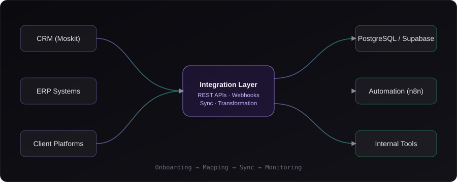

 

  

 

 

## About

I'm a **Technical Implementation Engineer at Moskit CRM**, based in Brazil. I sit at the point where a client's existing tools — their CRM, their ERP, their internal spreadsheets and half-documented APIs — need to become one working system instead of five disconnected ones.

Most days that means reading an unfamiliar API's docs by 10am and having a working webhook pipeline by the afternoon. The job is equal parts engineering and translation: turning "we need these two systems to talk" into architecture that actually holds up in production.

<table>
<tr>
<td width="50%" valign="top">

### Current Focus
- Implementing CRM integrations end-to-end for new clients
- Designing REST API contracts between disparate systems
- Building resilient webhook + sync pipelines
- Shipping internal developer tooling to speed up onboarding

</td>
<td width="50%" valign="top">

### How I Work
- Favor boring, observable architecture over clever architecture
- Automate the repetitive parts of onboarding first
- Document integrations like someone else will maintain them
- Treat AI tooling as leverage, not a shortcut around understanding

</td>
</tr>
</table>

 

## Areas of Expertise

<table>
<tr>
<td width="33%" align="center">
 
<b>API Architecture</b> 
REST design, versioning, auth, rate limiting
</td>
<td width="33%" align="center">
 
<b>Webhooks & Events</b> 
Event-driven sync between systems
</td>
<td width="33%" align="center">
 
<b>Workflow Automation</b> 
n8n / Make pipelines that hold up
</td>
</tr>
<tr><td colspan="3" height="16"></td></tr>
<tr>
<td width="33%" align="center">
 
<b>Data Synchronization</b> 
Keeping CRM/ERP state consistent
</td>
<td width="33%" align="center">
 
<b>Data Layer</b> 
PostgreSQL, Supabase, schema design
</td>
<td width="33%" align="center">
 
<b>Systems Architecture</b> 
Designing for the integration that comes next
</td>
</tr>
</table>

 

## Architecture

A simplified view of the kind of integration layer I build for client onboarding — client systems on the left, integration layer in the middle, destination systems on the right.

 

## Selected Work

> Most of what I build lives in **private repositories** — client CRM/ERP integrations, internal automation tooling, and infrastructure that isn't mine to publish. What's public here is a small set of **self-contained experiments**: things I build to learn, stress-test an idea, or share a pattern that isn't tied to client work.

<table>
<tr>
<td width="50%">

**🔗 [experiment-name-one](https://github.com/JrAutomatiza/repo-one)**
 
Short, honest description of what it actually does.

</td>
<td width="50%">

**🔗 [experiment-name-two](https://github.com/JrAutomatiza/repo-two)**
 
Short, honest description of what it actually does.

</td>
</tr>
</table>

 

## Tech Stack

  

 

## GitHub Stats

 

 

## Contribution Graph

Generated automatically by the workflow in <code>.github/workflows/snake.yml</code>

 

## Currently Learning

<table>
<tr>
<td width="33%" align="center"><b>Cloudflare Workers</b> Edge functions for lightweight integration endpoints</td>
<td width="33%" align="center"><b>AI-assisted automation</b> Using LLMs inside workflow pipelines, not just for chat</td>
<td width="33%" align="center"><b>System design at scale</b> Architecture patterns for high-volume sync</td>
</tr>
</table>

 

## Contact

If you're dealing with a CRM/ERP integration that refuses to behave, or want to talk architecture — reach out.

  
© Ruan Dias — Built with intent, not a template.

